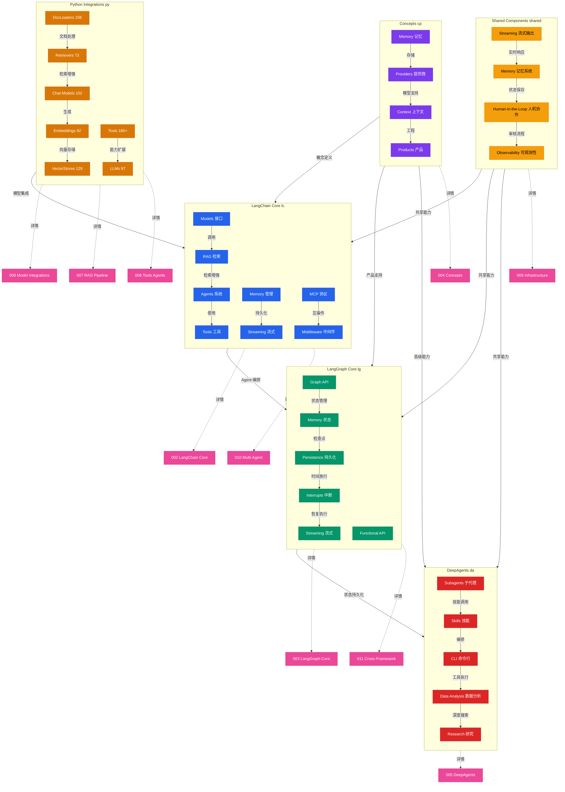

> Navigation: [[001-overview-architecture|当前]] | [[002-langchain-core|下一页]] | [[012-ecosystem-navigation|012 导航中心]]

## 概述

本文档提供了 LangChain 生态系统的完整架构全景图，展示了核心框架、高级框架、Python 集成、跨域视图和共享组件之间的关系。通过六大域的可视化呈现，开发者可以快速理解 LangChain 生态的层次结构、数据流向和集成方式，为构建 AI 应用提供架构导航。

## 知识地图



## 架构分层

| 层级 | 域 | 职责 | 颜色标识 |
|------|-----|------|---------|
| 核心框架层 | LangChain Core, LangGraph Core | 基础抽象、Agent 编排、图式编排 | lc, lg |
| 高级框架层 | DeepAgents | 企业级多智能体系统 | da |
| 集成层 | Python Integrations | 模型、向量存储、工具、文档加载 | py |
| 概念层 | Concepts | 上下文、记忆、产品、提供商 | cp |
| 共享层 | Shared Components | 流式输出、记忆、人机协作、可观测性 | shared |
| 导航层 | Cross References | 地图间索引和跳转 | xref |

## 核心能力映射

| 能力 | LangChain Core | LangGraph Core | DeepAgents | Python Integrations |
|------|----------------|----------------|------------|---------------------|
| Agent 系统 | Agents, Multi-Agent | Workflows, Agents | Subagents, Skills | Tools (160+) |
| 记忆管理 | Short/Long-Term Memory | Persistence, Checkpointers | Memory | Chat Histories, Stores |
| 流式输出 | Streaming | Streaming | Streaming | - |
| 上下文工程 | Context Engineering | - | Context Engineering | - |
| 人机协作 | Human-in-the-Loop | Interrupts | Human-in-the-Loop | - |
| 模型集成 | Models | - | Models | Chat 102, LLMs 97, Emb 92 |
| RAG 能力 | RAG, Retrieval | Agentic RAG | - | VectorStores 129, Retrievers 73 |

## 数据流向

```
用户输入
  ↓
上下文工程 (LC Context Engineering)
  ↓
模型选择 (Py Chat/LLMs/Embeddings)
  ↓
记忆层 (LC Memory + LG Persistence)
  ↓
工具执行 (Py Tools + LC Agents)
  ↓
流式输出 (Shared Streaming)
  ↓
人机协作 (Shared HITL)
  ↓
可观测性 (Shared Observability)
  ↓
前端输出 (LC/LG/DA Frontend)
```

## 关键统计

| 类别 | 数量 | 说明 |
|------|------|------|
| 核心域 | 6 个 | LangChain Core, LangGraph Core, DeepAgents, Python Integrations, Concepts, Shared |
| 地图文件 | 12 个 | 001-012 知识地图 |
| Chat Models | 102+ | OpenAI, Anthropic, Azure, Cohere 等 |
| LLMs | 97+ | OpenAI, Anthropic, Hugging Face 等 |
| Embeddings | 92+ | OpenAI, Cohere, Hugging Face 等 |
| Vector Stores | 129+ | Chroma, FAISS, Pinecone, Qdrant 等 |
| Tools | 160+ | 搜索、代码、云服务、浏览器等 |
| Document Loaders | 198+ | Web, 文件、云存储、API 等 |

## 关联地图

| 编号 | 地图名称 | 域 | 关键主题 |
|------|---------|-----|---------|
| 002 | LangChain Core | lc | Agents, Memory, Models, RAG, Streaming, Tools, MCP, Middleware |
| 003 | LangGraph Core | lg | Graph API, Functional API, Memory, Persistence, Interrupts, Streaming |
| 004 | Concepts and Products | cp | Context, Memory, Products, Providers |
| 005 | DeepAgents | da | Subagents, Skills, CLI, Data Analysis, Research |
| 006 | Model Integrations | py | Chat 102, LLMs 97, Embeddings 92 |
| 007 | RAG Pipeline | py | DocLoaders 198, VectorStores 129, Retrievers 73 |
| 008 | Tools and Agents | py | Tools 160+, Sandboxes, Graphs, Callbacks |
| 009 | Infrastructure | py | Chat Histories, Checkpointers, Stores, Caches, Adapters |
| 010 | Multi-Agent Systems | xref | LangChain MA, LangGraph Agents, DeepAgents |
| 011 | Cross-Framework Data Flow | xref | 完整数据处理流程 (10 阶段) |
| 012 | Ecosystem Navigation | navigation | 导航中心和学习路径 |

## 学习路径

### 初学者路径
001 生态全景 → 002 LangChain Core → 003 LangGraph Core

### RAG 开发路径
004 概念与产品 → 007 RAG Pipeline → 006 模型集成

### Agent 开发路径
002 LangChain Agents → 010 Multi-Agent → 005 DeepAgents

### 集成开发路径
006 模型集成 → 008 工具与代理 → 009 基础设施

## 相关 Wiki 页面

- [[001-overview-architecture|生态架构详情]]
- [[002-langchain-core|LangChain Core 详情]]
- [[003-langgraph-core|LangGraph Core 详情]]
- [[012-ecosystem-navigation|导航中心]]
