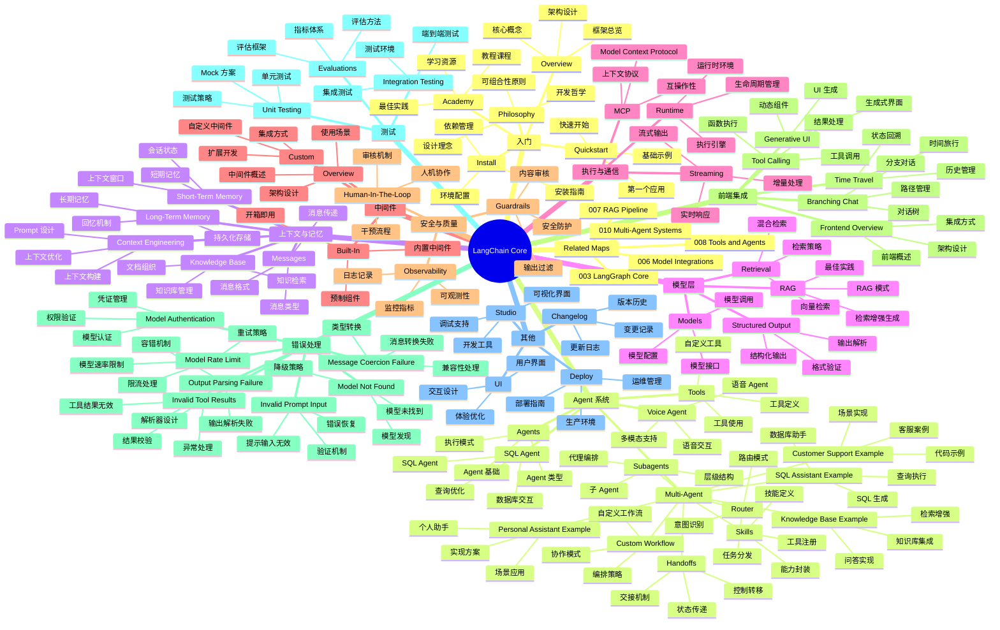

> Navigation: [[001-overview-architecture|001 总览]] | [[002-langchain-core|当前]] | [[003-langgraph-core|下一页]] | [[012-ecosystem-navigation|012 导航中心]]

## 概述

LangChain Core 是 LangChain 生态的核心框架，提供构建 LLM 应用的基础能力。本地图覆盖 Agent 系统、上下文工程、模型交互、记忆管理、执行运行时、前端集成、中间件、测试等核心概念模块。LangChain Core 采用模块化设计，支持从简单的单模型调用到复杂的多 Agent 协作系统。

## 知识地图

## 关键统计

| 类别 | 数量 | 代表项 |
|------|------|--------|
| 入门指南 | 5 | Overview, Quickstart, Install |
| Agent 系统 | 12 | Agents, Multi-Agent, Tools |
| 上下文与记忆 | 5 | Context, Memory, Messages |
| 模型层 | 4 | Models, RAG, Retrieval |
| 执行与通信 | 3 | Runtime, Streaming, MCP |
| 中间件 | 3 | Overview, Built-In, Custom |
| 安全与质量 | 3 | Guardrails, HITL, Observability |
| 前端集成 | 5 | Overview, Branching, UI, Tool, Time |
| 错误处理 | 7 | 7 种错误类型处理 |
| 测试 | 3 | Unit, Integration, Eval |

## 关联地图

| 主题 | 关联地图 | 关联主题 |
|------|---------|---------|
| 图框架 | 003-langgraph-core | LangGraph 核心概念 |
| 模型集成 | 006-model-integrations | 模型提供商集成 |
| RAG 系统 | 007-rag-pipeline | 检索增强生成 |
| 工具系统 | 008-tools-and-agents | 工具与 Agent |
| 多 Agent | 010-multi-agent-systems | 多 Agent 协作 |

## 相关 Wiki 页面

- [[002-langchain-core|LangChain Core 详情]]
- [[003-langgraph-core|LangGraph Core 详情]]
- [[001-overview-architecture|生态架构总览]]
