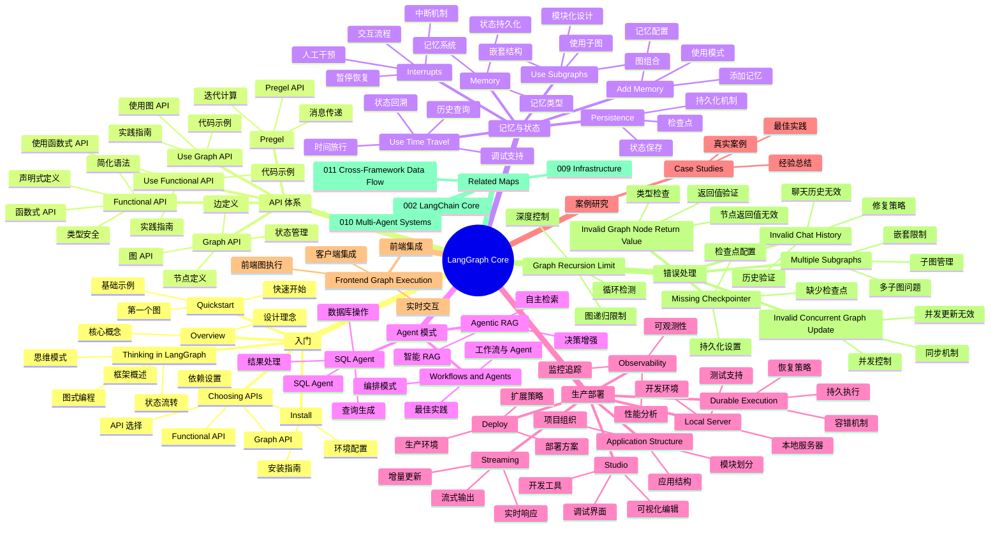

> Navigation: [[002-langchain-core|上一页]] | [[003-langgraph-core|当前]] | [[004-concepts-and-products|下一页]] | [[012-ecosystem-navigation|012 导航中心]]

## 概述

LangGraph 是 LangChain 生态中的状态图编排框架，专注于构建有状态的、多步骤的 AI 应用。本地图覆盖 Graph API、Functional API、记忆与状态管理、Agent 模式、生产部署、前端集成和错误处理等核心模块。LangGraph 通过图结构定义应用逻辑，支持持久化、时间旅行、子图等高级特性。

## 知识地图

## 关键统计

| 类别 | 数量 | 代表项 |
|------|------|--------|
| 入门指南 | 5 | Overview, Quickstart, Thinking |
| API 体系 | 5 | Graph API, Functional API, Pregel |
| 记忆与状态 | 6 | Memory, Persistence, Subgraphs |
| Agent 模式 | 3 | Workflows, Agentic RAG, SQL |
| 生产部署 | 7 | Structure, Durable, Observability |
| 案例研究 | 1 | Case Studies |
| 前端集成 | 1 | Frontend Execution |
| 错误处理 | 6 | 6 种错误类型 |

## 关联地图

| 主题 | 关联地图 | 关联主题 |
|------|---------|---------|
| 核心框架 | 002-langchain-core | LangChain 基础 |
| 基础设施 | 009-infrastructure | 部署与运维 |
| 多 Agent | 010-multi-agent-systems | 复杂编排 |
| 跨框架 | 011-cross-framework-data-flow | 数据流设计 |

## 相关 Wiki 页面

- [[003-langgraph-core|LangGraph Core 详情]]
- [[002-langchain-core|LangChain Core 详情]]
- [[004-concepts-and-products|概念与产品]]
