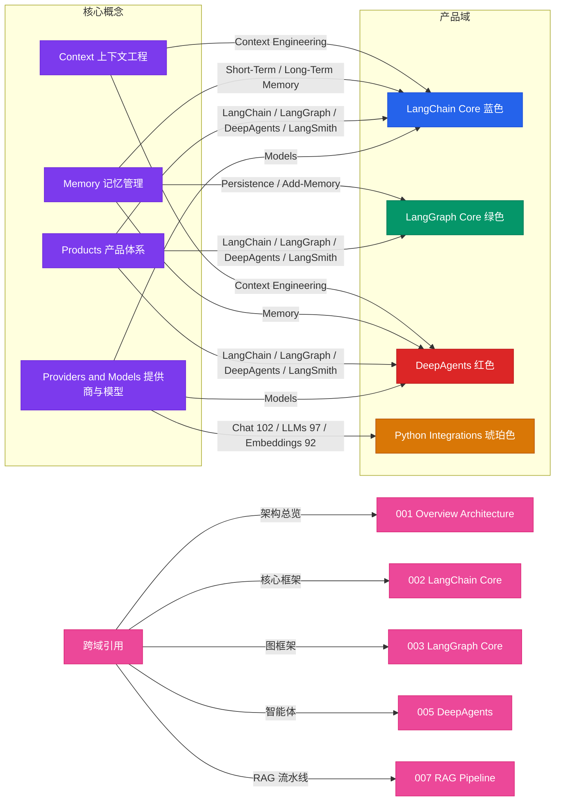

> Navigation: [[003-langgraph-core|上一页]] | [[004-concepts-and-products|当前]] | [[005-deepagents|下一页]] | [[012-ecosystem-navigation|012 导航中心]]

## 概述

本图展示了 LangChain 生态中四个核心概念（Context、Memory、Products、Providers and Models）与各产品域之间的映射关系。通过这种可视化呈现，可以清晰理解每个概念在不同框架中的具体实现和集成方式，为开发者提供从概念学习到产品应用的知识导航。

## 知识地图

## 关键统计

| 概念 | 关联产品数 | 主要实现 |
|------|----------|---------|
| Context（上下文） | 2 | Context Engineering (LC/DA) |
| Memory（记忆） | 3 | ST/LT Memory, Persistence, Memory |
| Products（产品） | 3 | 全产品栈支持 |
| Providers（提供商） | 3 | Models, Chat/LLMs/Embeddings |

## 关联地图

| 主题 | 关联地图 | 关联主题 |
|------|---------|---------|
| 生态架构 | 001-overview-architecture | LangChain 生态全景 |
| 核心框架 | 002-langchain-core | LangChain 详细知识 |
| 图框架 | 003-langgraph-core | LangGraph 详细知识 |
| 智能体 | 005-deepagents | DeepAgents 详细知识 |
| RAG 流水线 | 007-rag-pipeline | RAG 实现方案 |

## 概念说明

### Context（上下文工程）
- **LangChain Core**: 提供完整的上下文工程能力，包括 Prompt 设计、上下文优化、知识库集成
- **DeepAgents**: 在 Agent 系统中应用上下文工程，实现智能上下文管理

### Memory（记忆管理）
- **LangChain Core**: 短期记忆和长期记忆的完整实现
- **LangGraph Core**: 持久化和检查点机制，支持状态回溯
- **DeepAgents**: 记忆系统在多 Agent 环境中的应用

### Products（产品体系）
- **LangSmith**: 开发者平台和 observability 工具
- **LangChain/LangGraph**: 核心开发框架
- **DeepAgents**: 高级 Agent 编排平台

### Providers and Models（提供商与模型）
- **Chat Models**: 102+ 集成（如 OpenAI, Anthropic, 等）
- **LLMs**: 97+ 集成
- **Embeddings**: 92+ 集成
- 跨框架统一模型接口

## 相关 Wiki 页面

- [[004-concepts-and-products|概念与产品详情]]
- [[001-overview-architecture|生态架构总览]]
- [[002-langchain-core|LangChain Core]]
- [[003-langgraph-core|LangGraph Core]]
