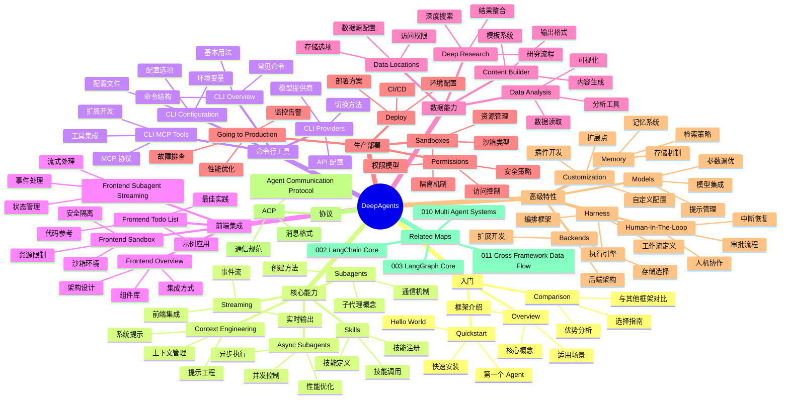

> Navigation: [[001-overview-architecture|001 总览]] | [[005-deepagents|当前]] | [[006-model-integrations|下一页]] | [[012-ecosystem-navigation|012 导航中心]]

## 概述

DeepAgents 是 LangChain 生态系统中的高级多智能体框架，专注于构建具备自主能力的 AI 系统。它提供了 Subagents、Skills、Streaming 等核心能力，支持命令行工具、前端集成、数据分析和生产部署。DeepAgents 强调上下文工程、权限管理和沙箱隔离，适用于构建企业级 AI 应用。

## 知识地图

## 关键统计

| 类别 | 数量 | 代表项 |
|------|------|--------|
| 核心文档 | 32 篇 | Overview, Subagents, Skills |
| CLI 文档 | 4 篇 | Configuration, MCP Tools |
| 前端集成 | 4 篇 | Overview, Sandbox, Streaming |
| 协议规范 | 1 篇 | ACP |

## 关联地图

| 主题 | 关联地图 | 关联主题 |
|------|---------|---------|
| 多智能体系统 | 010-multi-agent-systems | Subagents, Skills, Handoffs |
| 跨框架数据流 | 011-cross-framework-data-flow | Context Engineering, Memory, Streaming |
| LangChain 核心 | 002-langchain-core | Tools, Agents, Context |
| LangGraph 核心 | 003-langgraph-core | Workflows, Subgraphs, Interrupts |

## 相关 Wiki 页面

- [[005-deepagents/overview]] DeepAgents 概览
- [[005-deepagents/subagents]] 子代理系统
- [[005-deepagents/skills]] 技能系统
- [[005-deepagents/streaming]] 流式处理
- [[005-deepagents/context-engineering]] 上下文工程
- [[005-deepagents/cli/overview]] 命令行工具
- [[005-deepagents/frontend/overview]] 前端集成
