> Navigation: [[001-overview-architecture|001 总览]] | [[006-model-integrations|当前]] | [[007-rag-pipeline|下一页]] | [[012-ecosystem-navigation|012 导航中心]]

## 概述

LangChain 提供了业界最广泛的 AI 模型集成支持，涵盖 90+ Chat Model 提供商、96+ LLM 提供商和 86+ Embedding 提供商。这些集成统一了不同模型的 API 接口，使开发者可以轻松切换和组合使用不同提供商的服务。Provider 层作为主入口，组织了所有模型提供商的集成配置。

## 知识地图

```mermaid
flowchart TD
    classDef lc fill:#2563EB,color:#fff,stroke:#1D4ED8
    classDef lg fill:#059669,color:#fff,stroke:#047857
    classDef py fill:#D97706,color:#fff,stroke:#B45309
    classDef cp fill:#7C3AED,color:#fff,stroke:#6D28D9
    classDef da fill:#DC2626,color:#fff,stroke:#B91C1C
    classDef xref fill:#EC4899,color:#fff,stroke:#DB2777
    classDef shared fill:#F59E0B,color:#000,stroke:#D97706

    Providers["Providers(413+)"]:::py
    Providers --> ChatModels["Chat Models(90 providers)"]:::py
    Providers --> LLMs["LLMs(96 providers)"]:::py
    Providers --> Embeddings["Embeddings(86 providers)"]:::py

    ChatModels --> OpenAIChat["OpenAI"]:::py
    ChatModels --> AnthropicChat["Anthropic"]:::py
    ChatModels --> AzureOpenAI["Azure OpenAI"]:::py
    ChatModels --> CohereChat["Cohere"]:::py
    ChatModels --> OllamaChat["Ollama"]:::py
    ChatModels --> MistralChat["MistralAI"]:::py
    ChatModels --> GroqChat["Groq"]:::py
    ChatModels --> CerebrasChat["Cerebras"]:::py
    ChatModels --> BedrockChat["AWS Bedrock"]:::py
    ChatModels --> GoogleGenAI["Google Generative AI"]:::py
    ChatModels --> VertexAIChat["Vertex AI"]:::py
    ChatModels --> DeepSeekChat["DeepSeek"]:::py
    ChatModels --> FireworksChat["Fireworks"]:::py
    ChatModels --> TogetherChat["Together AI"]:::py
    ChatModels --> XAIChat["xAI"]:::py
    ChatModels --> OtherChat["... 75+ more"]:::py

    LLMs --> OpenAILLM["OpenAI"]:::py
    LLMs --> AnthropicLLM["Anthropic"]:::py
    LLMs --> CohereLLM["Cohere"]:::py
    LLMs --> HuggingFace["Hugging Face"]:::py
    LLMs --> AzureLLM["Azure OpenAI"]:::py
    LLMs --> BedrockLLM["AWS Bedrock"]:::py
    LLMs --> GoogleLLM["Google Generative AI"]:::py
    LLMs --> VertexAILLM["Vertex AI"]:::py
    LLMs --> OllamaLLM["Ollama"]:::py
    LLMs --> OtherLLM["... 86+ more"]:::py

    Embeddings --> OpenAIEmb["OpenAI"]:::py
    Embeddings --> CohereEmb["Cohere"]:::py
    Embeddings --> HuggingFaceEmb["Hugging Face"]:::py
    Embeddings --> GoogleEmb["Google Generative AI"]:::py
    Embeddings --> VertexAIEmb["Vertex AI"]:::py
    Embeddings --> BedrockEmb["AWS Bedrock"]:::py
    Embeddings --> AzureEmb["Azure OpenAI"]:::py
    Embeddings --> MistralEmb["MistralAI"]:::py
    Embeddings --> OllamaEmb["Ollama"]:::py
    Embeddings --> JinaEmb["Jina"]:::py
    Embeddings --> VoyageAI["Voyage AI"]:::py
    Embeddings --> OtherEmb["... 75+ more"]:::py

    OpenAIChat -.-> SharedOpenAI["OpenAI Ecosystem"]:::shared
    OpenAILLM -.-> SharedOpenAI
    OpenAIEmb -.-> SharedOpenAI

    AnthropicChat -.-> SharedAnthropic["Anthropic Ecosystem"]:::shared
    AnthropicLLM -.-> SharedAnthropic

    AzureOpenAI -.-> SharedAzure["Azure Ecosystem"]:::shared
    AzureLLM -.-> SharedAzure
    AzureEmb -.-> SharedAzure

    CohereChat -.-> SharedCohere["Cohere Ecosystem"]:::shared
    CohereLLM -.-> SharedCohere
    CohereEmb -.-> SharedCohere

    BedrockChat -.-> SharedBedrock["AWS Bedrock"]:::shared
    BedrockLLM -.-> SharedBedrock
    BedrockEmb -.-> SharedBedrock

    OllamaChat -.-> SharedOllama["Ollama Ecosystem"]:::shared
    OllamaLLM -.-> SharedOllama
    OllamaEmb -.-> SharedOllama

    CrossRef1["002 LangChain Core - Models"]:::xref
    CrossRef2["004 Providers and Models"]:::xref
    CrossRef3["007 RAG - Embeddings"]:::xref

    Providers -.-> CrossRef1
    Providers -.-> CrossRef2
    Embeddings -.-> CrossRef3
```

## 关键统计

| 类别 | 数量 | 代表项 |
|------|------|--------|
| Providers | 413 | 所有集成提供商的统一配置入口 |
| Chat Models | 90 | OpenAI, Anthropic, Azure OpenAI, Cohere, Ollama, MistralAI, Groq, Cerebras, xAI, DeepSeek |
| LLMs | 96 | OpenAI, Anthropic, Cohere, Hugging Face, Azure OpenAI, AWS Bedrock, Google, Vertex AI |
| Embeddings | 86 | OpenAI, Cohere, Hugging Face, Google, Vertex AI, Jina, Voyage AI, MistralAI |

## 跨类别提供商

许多提供商同时支持多种模型类型：

- **OpenAI 生态**: Chat, LLM, Embeddings 全覆盖
- **Anthropic**: Chat, LLM
- **Azure OpenAI**: Chat, LLM, Embeddings
- **Cohere**: Chat, LLM, Embeddings
- **AWS Bedrock**: Chat, LLM, Embeddings
- **Google/Vertex AI**: Chat, LLM, Embeddings
- **Ollama**: Chat, LLM, Embeddings
- **MistralAI**: Chat, Embeddings

## 关联地图

| 主题 | 关联地图 | 关联主题 |
|------|---------|---------|
| 模型架构 | 002 LangChain Core | LC Models, I/O Runnables |
| 提供商详解 | 004 Concepts | Providers and Models |
| RAG 组件 | 007 RAG Pipeline | Embeddings 在 RAG 中的应用 |

## 相关 Wiki 页面

- [[chat-models/]] Chat Models 集成列表
- [[llms/]] LLMs 集成列表
- [[embeddings/]] Embeddings 集成列表
- [[providers/]] Providers 配置指南
