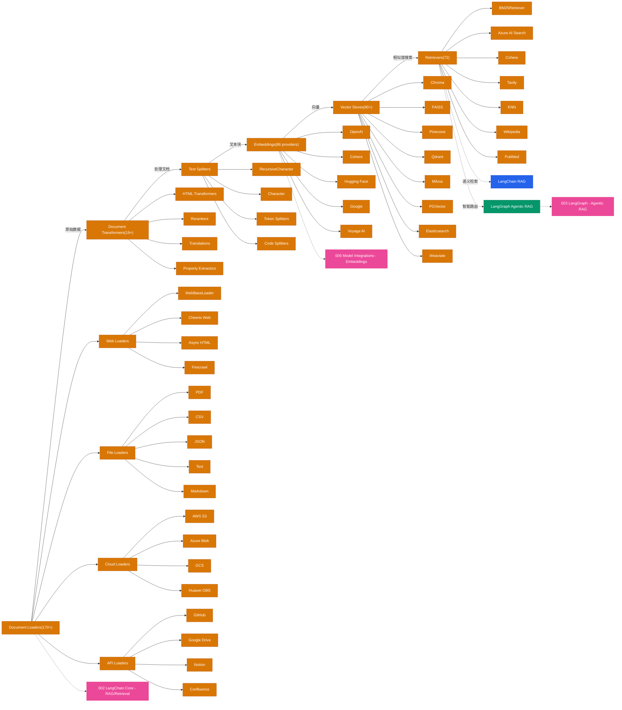

> Navigation: [[006-model-integrations|上一页]] | [[007-rag-pipeline|当前]] | [[008-tools-and-agents|下一页]] | [[012-ecosystem-navigation|012 导航中心]]

## 概述

RAG (Retrieval-Augmented Generation) 是 LangChain 的核心应用场景之一。完整的 RAG 管道包含数据加载、转换、分块、嵌入、向量存储和检索六个阶段。LangChain 提供了 170+ Document Loaders、19+ Document Transformers、多种 Text Splitters、86+ Embeddings 提供商、90+ Vector Stores 和 72+ Retrievers，构建了业界最完整的 RAG 生态系统。

## 知识地图

## 关键统计

| 类别 | 数量 | 代表项 |
|------|------|--------|
| Document Loaders | 170+ | Web, PDF, CSV, JSON, S3, Azure, GCS, GitHub, Notion |
| Document Transformers | 19+ | HTML, Rerankers, Translations, Extractors |
| Text Splitters | 多种 | Recursive, Character, Token, Code |
| Embeddings | 86 | OpenAI, Cohere, Hugging Face, Google, Voyage AI |
| Vector Stores | 90+ | Chroma, FAISS, Pinecone, Qdrant, Milvus, PGVector |
| Retrievers | 72 | BM25, Azure AI Search, Cohere, Tavily |

## 数据管道说明

1. **Document Loaders**: 从各种数据源加载原始文档
   - Web Loaders: 网页抓取和爬虫
   - File Loaders: 本地文件系统
   - Cloud Loaders: 云存储服务
   - API Loaders: 第三方 API 集成

2. **Document Transformers**: 清洗和预处理文档
   - HTML 转换: 提取纯净文本
   - Rerankers: 重新排序内容
   - Translations: 多语言翻译
   - Extractors: 结构化数据提取

3. **Text Splitters**: 智能分块策略
   - RecursiveCharacter: 递归字符分割
   - Character: 固定字符数分割
   - Token: Token 数量分割
   - Code: 代码专用分割

4. **Embeddings**: 文本向量化
   - 提供商: OpenAI, Cohere, Hugging Face 等
   - 作为文本到向量的桥梁

5. **Vector Stores**: 向量数据库
   - 存储: 高效向量索引
   - 检索: 相似度搜索

6. **Retrievers**: 高级检索策略
   - 稠密检索: 向量相似度
   - 稀疏检索: BM25/TF-IDF
   - 混合检索: 结合多种方法
   - 重排序: 优化结果质量

## 关联地图

| 主题 | 关联地图 | 关联主题 |
|------|---------|---------|
| LangChain RAG | 002 LangChain Core | LC RAG, Retrieval Chain |
| LangGraph RAG | 003 LangGraph Core | Agentic RAG, Agent RAG |
| 模型集成 | 006 Model Integrations | Embeddings 提供商 |

## 相关 Wiki 页面

- [[document_loaders/]] Document Loaders 完整列表
- [[document_transformers/]] Document Transformers 列表
- [[text_splitters/]] Text Splitters 指南
- [[embeddings/]] Embeddings 集成列表
- [[vectorstores/]] Vector Stores 集成列表
- [[retrievers/]] Retrievers 集成列表
