> Navigation: [[007-rag-pipeline|上一页]] | [[008-tools-and-agents|当前]] | [[009-infrastructure|下一页]] | [[012-ecosystem-navigation|012 导航中心]]

## 概述

LangChain 的 Agent 系统通过工具集成实现了强大的 AI 智能体能力。工具层提供了 100+ 集成，覆盖搜索、代码执行、云服务、数据处理、浏览器自动化等场景。这些工具可被 LangChain Agents、LangGraph Workflows 和 DeepAgents 等不同框架的 Agent 系统调用，构建复杂的智能应用。

## 知识地图

```mermaid
flowchart TD
    classDef lc fill:#2563EB,color:#fff,stroke:#1D4ED8
    classDef lg fill:#059669,color:#fff,stroke:#047857
    classDef py fill:#D97706,color:#fff,stroke:#B45309
    classDef cp fill:#7C3AED,color:#fff,stroke:#6D28D9
    classDef da fill:#DC2626,color:#fff,stroke:#B91C1C
    classDef xref fill:#EC4899,color:#fff,stroke:#DB2777
    classDef shared fill:#F59E0B,color:#000,stroke:#D97706

    LCAgents["LangChain Agents"]:::lc
    LGWorkflows["LangGraph Workflows"]:::lg
    DAAgents["DeepAgents"]:::da

    Tools["Tools Integration(100+)"]:::py

    LCAgents -->|"使用"| Tools
    LGWorkflows -->|"编排"| Tools
    DAAgents -->|"增强"| Tools

    Tools --> SearchTools["搜索工具"]:::py
    Tools --> CodeTools["代码工具"]:::py
    Tools --> CloudTools["云服务"]:::py
    Tools --> DataTools["数据工具"]:::py
    Tools --> BrowserTools["浏览器工具"]:::py
    Tools --> APITools["API 工具"]:::py

    SearchTools --> Bing["Bing Search"]:::py
    SearchTools --> Google["Google Search"]:::py
    SearchTools --> Tavily["Tavily"]:::py
    SearchTools --> Brave["Brave Search"]:::py
    SearchTools --> DuckDuckGo["DDG Search"]:::py
    SearchTools --> Exa["Exa Search"]:::py
    SearchTools --> Mojeek["Mojeek"]:::py
    SearchTools --> Naver["Naver Search"]:::py
    SearchTools --> Jina["Jina Search"]:::py

    CodeTools --> Bash["Bash"]:::py
    CodeTools --> PythonREPL["Python REPL"]:::py
    CodeTools --> AWSLambda["AWS Lambda"]:::py
    CodeTools --> E2B["E2B Data Analysis"]:::py
    CodeTools --> Daytona["Daytona Analysis"]:::py

    CloudTools --> AWS["AWS Toolkit"]:::py
    CloudTools --> Azure["Azure Services"]:::py
    CloudTools --> GCP["Google Cloud"]:::py
    CloudTools --> Databricks["Databricks"]:::py

    DataTools --> SQL["SQL Database"]:::py
    DataTools --> Pandas["Dataframe"]:::py
    DataTools --> GraphQL["GraphQL"]:::py
    DataTools --> Cassandra["Cassandra DB"]:::py
    DataTools --> Memgraph["Memgraph"]:::py

    BrowserTools --> BrowserBase["BrowserBase"]:::py
    BrowserTools --> HyperBrowser["HyperBrowser"]:::py
    BrowserTools --> Playwright["Playwright"]:::py
    BrowserTools --> Selenium["Selenium"]:::py

    APITools --> GitHubAPI["GitHub"]:::py
    APITools --> GitLab["GitLab"]:::py
    APITools --> Jira["Jira"]:::py
    APITools --> Slack["Slack"]:::py
    APITools --> Discord["Discord"]:::py
    APITools --> GoogleDrive["Google Drive"]:::py
    APITools --> Gmail["Google Gmail"]:::py
    APITools --> NotionAPI["Notion"]:::py
    APITools --> HubSpot["HubSpot"]:::py
    APITools --> Salesforce["Salesforce"]:::py

    Support["Support Components"]:::py

    Support --> Sandboxes["Sandboxes(4)"]:::py
    Support --> Graphs["Graphs(16)"]:::py
    Support --> Chains["Chains(1)"]:::py
    Support --> Callbacks["Callbacks(16)"]:::py

    Sandboxes -.->|"执行环境"| CodeTools
    Graphs -.->|"知识图谱"| Tools
    Callbacks -.->|"监控追踪"| LCAgents

    Sandboxes --> AWSandbox["AWS Sandbox"]:::py
    Sandboxes --> DaytonaSB["Daytona"]:::py
    Sandboxes --> ModalSB["Modal"]:::py
    Sandboxes --> Runloop["Runloop"]:::py

    Graphs --> Neo4j["Neo4j"]:::py
    Graphs --> NetworkX["NetworkX"]:::py
    Graphs --> ArangoDB["ArangoDB"]:::py
    Graphs --> TigerGraph["TigerGraph"]:::py

    Callbacks --> Argilla["Argilla"]:::py
    Callbacks --> Comet["Comet Tracing"]:::py
    Callbacks --> Context["Context"]:::py
    Callbacks --> PromptLayer["PromptLayer"]:::py
    Callbacks --> Uptrain["Uptrain"]:::py
    Callbacks --> Streamlit["Streamlit"]:::py

    CrossRef1["002 LangChain Core - Agents/Tools"]:::xref
    CrossRef2["005 DeepAgents - Skills"]:::xref
    CrossRef3["010 Multi-Agent Systems"]:::xref

    LCAgents -.-> CrossRef1
    DAAgents -.-> CrossRef2
    LGWorkflows -.-> CrossRef3
```

## 关键统计

| 类别 | 数量 | 代表项 |
|------|------|--------|
| Tools | 100+ | 搜索、代码、云服务、数据、浏览器 |
| Sandboxes | 4 | AWS, Daytona, Modal, Runloop |
| Graphs | 16 | Neo4j, NetworkX, ArangoDB, TigerGraph |
| Callbacks | 16 | Argilla, Comet, Context, PromptLayer |

## 工具分类详解

### 搜索工具
- Bing Search, Google Search, Tavily
- Brave Search, DuckDuckGo, Exa
- 专业搜索: Jina, Mojeek, Naver

### 代码工具
- Bash 命令执行
- Python REPL 交互式环境
- 云函数: AWS Lambda
- 数据分析: E2B, Daytona

### 云服务
- AWS Toolkit 完整集成
- Azure AI Services
- Google Cloud 系列
- Databricks 数据平台

### 数据工具
- SQL Database 查询
- Pandas Dataframe 操作
- GraphQL API
- 图数据库: Cassandra, Memgraph

### 浏览器工具
- BrowserBase 云浏览器
- HyperBrowser 网页自动化
- Playwright, Selenium

### API 集成
- 开发工具: GitHub, GitLab, Jira
- 通讯: Slack, Discord
- 生产力: Google Drive, Gmail, Notion
- 商业: HubSpot, Salesforce

## Agent 系统支持

- **LangChain Agents**: 传统 Agent 架构
- **LangGraph Workflows**: 状态机式 Agent
- **DeepAgents**: 增强型 Agent 系统

## 关联地图

| 主题 | 关联地图 | 关联主题 |
|------|---------|---------|
| LangChain Agents | 002 LangChain Core | LC Agents, Tools |
| DeepAgents Skills | 005 DeepAgents | DA Skills, Capabilities |
| Multi-Agent | 010 Multi-Agent | Agent 协作, 编排 |

## 相关 Wiki 页面

- [[tools/]] Tools 完整列表
- [[sandboxes/]] Sandboxes 集成
- [[graphs/]] Graph 数据库集成
- [[callbacks/]] Callbacks 和监控
