> Navigation: [[008-tools-and-agents|上一页]] | [[009-infrastructure|当前]] | [[010-multi-agent-systems|下一页]] | [[012-ecosystem-navigation|012 导航中心]]

## 概述

LangChain 的基础设施组件为 AI 应用提供了记忆、持久化和状态管理能力。这些组件包括 Chat Message Histories（对话历史）、Chat Loaders（对话加载）、Checkpointers（检查点）、Stores（状态存储）、Caches（缓存）和 Adapters（适配器）。它们与 LangChain Memory 和 LangGraph Persistence 深度集成，是构建生产级 AI 应用的关键基础设施。

## 知识地图

```mermaid
flowchart TD
    classDef lc fill:#2563EB,color:#fff,stroke:#1D4ED8
    classDef lg fill:#059669,color:#fff,stroke:#047857
    classDef py fill:#D97706,color:#fff,stroke:#B45309
    classDef cp fill:#7C3AED,color:#fff,stroke:#6D28D9
    classDef da fill:#DC2626,color:#fff,stroke:#B91C1C
    classDef xref fill:#EC4899,color:#fff,stroke:#DB2777
    classDef shared fill:#F59E0B,color:#000,stroke:#D97706

    subgraph MemoryInfra["记忆基础设施"]
        direction TB
        ChatHistories["Chat Message Histories"]:::lc
        ChatLoaders["Chat Loaders(7)"]:::py

        ChatHistories --> CockroachDB["CockroachDB"]:::py
        ChatHistories --> Postgres["PostgreSQL"]:::py
        ChatHistories --> Redis["Redis"]:::py
        ChatHistories --> MongoDB["MongoDB"]:::py

        ChatLoaders --> Facebook["Facebook"]:::py
        ChatLoaders --> Gmail["Google Gmail"]:::py
        ChatLoaders --> iMessage["iMessage"]:::py
        ChatLoaders --> Slack["Slack"]:::py
        ChatLoaders --> Twitter["Twitter"]:::py
        ChatLoaders --> LangSmithDS["LangSmith Dataset"]:::py
        ChatLoaders --> LangSmithLLM["LangSmith LLM Runs"]:::py
    end

    subgraph GraphInfra["图执行基础设施"]
        direction TB
        Checkpointers["Checkpointers"]:::lg
        Stores["Stores(8)"]:::py

        CheckpointerItems["State Checkpointing"]:::lg
        Checkpointers --> CheckpointerItems

        Stores --> AstraDB["AstraDB"]:::py
        Stores --> Cassandra["Cassandra"]:::py
        Stores --> Elastic["Elasticsearch"]:::py
        Stores --> RedisStore["Redis Store"]:::py
        Stores --> InMemory["In Memory"]:::py
        Stores --> FileSystem["File System"]:::py
        Stores --> Bigtable["Bigtable"]:::py
        Stores --> UpstashRedis["Upstash Redis"]:::py
    end

    subgraph Optimization["优化层"]
        direction TB
        Caches["Caches"]:::py
        Adapters["Adapters(2)"]:::py

        Caches --> RedisCache["Redis LLM Cache"]:::py
        Caches --> InMemoryCache["In Memory Cache"]:::py
        Caches --> GPTCache["GPTCache"]:::py

        Adapters --> OpenAIAdapter["OpenAI Adapter"]:::py
        Adapters --> BedrockAdapter["Bedrock Adapter"]:::py
    end

    LCMemory["LangChain Memory"]:::lc
    LGPersistence["LangGraph Persistence"]:::lg
    LGState["LangGraph State Management"]:::lg

    ChatHistories -->|"对话记忆"| LCMemory
    ChatLoaders -->|"导入历史"| LCMemory

    Checkpointers -->|"状态持久化"| LGPersistence
    Stores -->|"状态存储"| LGState

    Caches -.->|"性能优化"| LCMemory
    Adapters -.->|"接口兼容"| LCMemory

    CrossRef1["002 LangChain Core - Memory"]:::xref
    CrossRef2["003 LangGraph - Persistence"]:::xref

    LCMemory -.-> CrossRef1
    LGPersistence -.-> CrossRef2
```

## 关键统计

| 类别 | 数量 | 代表项 |
|------|------|--------|
| Chat Message Histories | 1+ | CockroachDB, PostgreSQL, Redis, MongoDB |
| Chat Loaders | 7 | Facebook, Gmail, iMessage, Slack, Twitter, LangSmith |
| Checkpointers | 1 | State Checkpointing |
| Stores | 8 | AstraDB, Cassandra, Elasticsearch, Redis, InMemory |
| Caches | 3 | Redis, InMemory, GPTCache |
| Adapters | 2 | OpenAI, Bedrock |

## 基础设施详解

### 记忆基础设施

**Chat Message Histories**: 存储和管理对话历史
- 支持 CockroachDB 等关系数据库
- 与 LangChain Memory 深度集成
- 提供对话上下文持久化

**Chat Loaders**: 从各种平台导入对话历史
- 社交平台: Facebook, Twitter, Slack
- 通讯工具: Gmail, iMessage
- AI 平台: LangSmith Dataset, LLM Runs
- 用于 Fine-tuning 和分析

### 图执行基础设施

**Checkpointers**: LangGraph 状态检查点
- 支持中断和恢复执行
- 状态版本控制
- 分布式执行支持

**Stores**: LangGraph 状态存储后端
- AstraDB: 云端 NoSQL
- Cassandra: 分布式数据库
- Elasticsearch: 搜索和分析
- Redis: 内存缓存
- InMemory: 本地开发
- FileSystem: 文件系统
- Bigtable: 大规模数据
- Upstash Redis: Serverless Redis

### 优化层

**Caches**: LLM 响应缓存
- Redis LLM Cache: 分布式缓存
- In Memory Cache: 本地缓存
- GPTCache: 智能语义缓存
- 降低 API 调用成本

**Adapters**: 接口适配器
- OpenAI Adapter: 标准 OpenAI 接口
- Bedrock Adapter: AWS Bedrock 适配
- 统一不同提供商接口

## 架构关系

- **LangChain Memory**: 依赖 Chat Histories 和 Chat Loaders
- **LangGraph Persistence**: 使用 Checkpointers 和 Stores
- **性能优化**: 通过 Caches 减少重复计算
- **兼容性**: 通过 Adapters 统一接口

## 关联地图

| 主题 | 关联地图 | 关联主题 |
|------|---------|---------|
| LangChain Memory | 002 LangChain Core | LC Memory, Conversation Memory |
| LangGraph Persistence | 003 LangGraph Core | LG Checkpointers, State Management |

## 相关 Wiki 页面

- [[chat_message_histories/]] Chat Message Histories 集成
- [[chat_loaders/]] Chat Loaders 集成列表
- [[stores/]] Stores 集成列表
- [[caches/]] Caches 配置指南
- [[checkpointers/]] Checkpointers 文档
