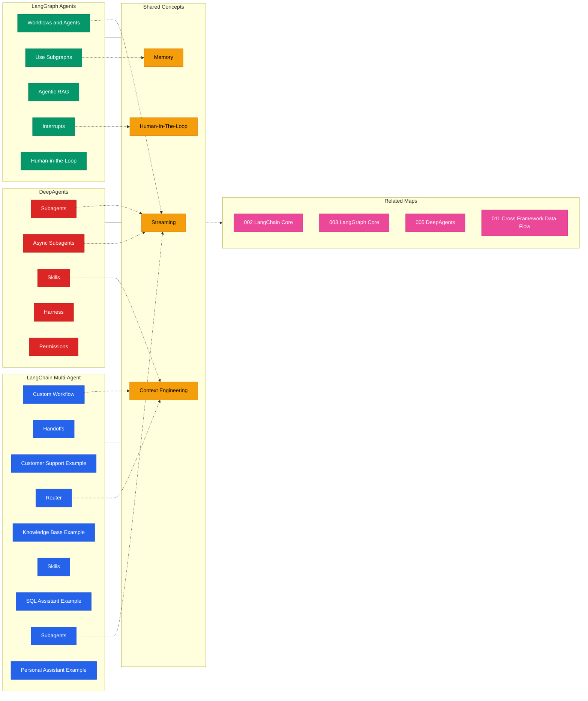

> Navigation: [[001-overview-architecture|001 总览]] | [[009-infrastructure|上一页]] | [[010-multi-agent-systems|当前]] | [[011-cross-framework-data-flow|下一页]] | [[012-ecosystem-navigation|012 导航中心]]

## 概述

多智能体系统是 LangChain 生态系统的核心能力之一，涵盖 LangChain Multi-Agent、LangGraph Agents 和 DeepAgents 三个框架。本地图展示了各框架的多智能体实现方式、路由机制、技能系统和人机协作等共享概念，帮助开发者理解跨框架的一致性和差异。

## 知识地图

## 关键统计

| 类别 | LangChain | LangGraph | DeepAgents |
|------|-----------|-----------|------------|
| 工作流模式 | 5 种 | 4 种 | 3 种 |
| 示例代码 | 4 个 | 3 个 | 内置 |
| 共享概念 | Streaming, Memory | Human-in-the-Loop | Context Engineering |

## 关联地图

| 主题 | 关联地图 | 关联主题 |
|------|---------|---------|
| LangChain 核心 | 002-langchain-core | Tools, Agents, Runnable |
| LangGraph 核心 | 003-langgraph-core | Graph API, Subgraphs, Persistence |
| DeepAgents | 005-deepagents | Subagents, Skills, Harness |
| 跨框架数据流 | 011-cross-framework-data-flow | 完整数据处理流程 |

## 框架对比

| 特性 | LangChain Multi-Agent | LangGraph Agents | DeepAgents |
|------|----------------------|------------------|------------|
| 工作流定义 | Runnable 链 | Graph 状态机 | Harness 编排 |
| 子代理 | Handoffs/Router | Subgraphs | Subagents |
| 技能系统 | Skills (LangChain) | 内置于 Graph | Skills (DA) |
| 人机协作 | 中断 + 审批 | Interrupts | Human-In-The-Loop |
| 流式输出 | Streaming | Streaming | Streaming |
| 适用场景 | 轻量级多代理 | 复杂状态流转 | 企业级应用 |

## 相关 Wiki 页面

### LangChain Multi-Agent
- [[010-multi-agent/custom-workflow]] 自定义工作流
- [[010-multi-agent/handoffs]] 代理切换
- [[010-multi-agent/router]] 路由机制
- [[010-multi-agent/skills]] 技能系统
- [[010-multi-agent/subagents]] 子代理

### LangGraph Agents
- [[010-multi-agent/workflows-agents]] 工作流与代理
- [[010-multi-agent/use-subgraphs]] 使用子图
- [[010-multi-agent/agentic-rag]] 智能检索
- [[010-multi-agent/interrupts]] 中断与人机协作

### DeepAgents
- [[010-multi-agent/subagents]] 子代理系统
- [[010-multi-agent/async-subagents]] 异步子代理
- [[010-multi-agent/skills]] 技能框架
- [[010-multi-agent/harness]] 编排系统
- [[010-multi-agent/permissions]] 权限管理
