> Navigation: [[001-overview-architecture|001 总览]] | [[010-multi-agent-systems|上一页]] | [[011-cross-framework-data-flow|当前]] | [[012-ecosystem-navigation|下一页]]

## 概述

本地图展示了 LangChain 生态系统中完整的数据处理流程，从用户输入到最终输出的全链路。它涵盖了 LangChain、LangGraph 和 DeepAgents 三个框架在上下文工程、模型选择、记忆管理、工具执行、流式输出和可观测性等方面的实现，帮助开发者理解跨框架的一致架构模式。

## 知识地图

```mermaid
flowchart TD
    subgraph INPUT["用户输入"]
        IN1["自然语言"]
        IN2["文件上传"]
        IN3["API 调用"]
        IN4["前端交互"]

        IN1:::gray
        IN2:::gray
        IN3:::gray
        IN4:::gray
    end

    subgraph CTXT["上下文工程"]
        CTXT1["LangChain Context Engineering"]
        CTXT2["Knowledge Base"]
        CTXT3["系统提示"]
        CTXT4["检索增强"]

        CTXT1:::lc
        CTXT2:::lc
        CTXT3:::lc
        CTXT4:::lc
    end

    subgraph MODEL["模型选择"]
        MODEL1["Chat Models 102+"]
        MODEL2["LLMs 97+"]
        MODEL3["Embeddings 92+"]

        MODEL1:::py
        MODEL2:::py
        MODEL3:::py
    end

    subgraph MEMORY["记忆层"]
        MEM1["Short-Term Memory"]
        MEM2["Long-Term Memory"]
        MEM3["Persistence"]
        MEM4["检索策略"]

        MEM1:::lc
        MEM2:::lc
        MEM3:::lg
        MEM4:::shared
    end

    subgraph TOOLS["工具执行"]
        TOOL1["Tools 160+"]
        TOOL2["Sandboxes"]
        TOOL3["MCP 协议"]
        TOOL4["自定义工具"]

        TOOL1:::py
        TOOL2:::py
        TOOL3:::py
        TOOL4:::py
    end

    subgraph STREAM["流式输出"]
        STRM1["Token Streaming"]
        STRM2["Event Streaming"]
        STRM3["Agent Events"]

        STRM1:::shared
        STRM2:::shared
        STRM3:::shared
    end

    subgraph MIDDLE["中间件"]
        MID1["Built-In Middleware"]
        MID2["Custom Middleware"]
        MID3["Hook System"]

        MID1:::lc
        MID2:::lc
        MID3:::lc
    end

    subgraph OUTPUT["输出处理"]
        OUT1["Structured Output"]
        OUT2["Guardrails"]
        OUT3["Validation"]
        OUT4["Format Conversion"]

        OUT1:::lc
        OUT2:::lc
        OUT3:::lc
        OUT4:::lc
    end

    subgraph OBS["可观测性"]
        OBS1["Logging"]
        OBS2["Tracing"]
        OBS3["Metrics"]
        OBS4["Debugging"]

        OBS1:::shared
        OBS2:::shared
        OBS3:::shared
        OBS4:::shared
    end

    subgraph FRONTEND["前端"]
        FE1["LangChain Frontend"]
        FE2["LangGraph Frontend"]
        FE3["DeepAgents Frontend"]

        FE1:::lc
        FE2:::lg
        FE3:::da
    end

    subgraph XREF["相关地图"]
        XR1["002 LangChain Core"]
        XR2["003 LangGraph Core"]
        XR3["005 DeepAgents"]
        XR4["006 Model Integrations"]
        XR5["007 RAG Pipeline"]
        XR6["008 Tools Agents"]
        XR7["009 Infrastructure"]

        XR1:::xref
        XR2:::xref
        XR3:::xref
        XR4:::xref
        XR5:::xref
        XR6:::xref
        XR7:::xref
    end

    INPUT -->|1| CTXT
    CTXT -->|2| MODEL
    MODEL -->|3| MEMORY
    MEMORY -->|4| TOOLS
    TOOLS -->|5| STREAM
    STREAM -->|6| MIDDLE
    MIDDLE -->|7| OUTPUT
    OUTPUT -->|8| OBS
    OBS -->|9| FRONTEND

    OBS -.-> XREF

    classDef lc fill:#2563EB,color:#fff,stroke:#1D4ED8
    classDef lg fill:#059669,color:#fff,stroke:#047857
    classDef py fill:#D97706,color:#fff,stroke:#B45309
    classDef cp fill:#7C3AED,color:#fff,stroke:#6D28D9
    classDef da fill:#DC2626,color:#fff,stroke:#B91C1C
    classDef xref fill:#EC4899,color:#fff,stroke:#DB2777
    classDef shared fill:#F59E0B,color:#000,stroke:#D97706
    classDef gray fill:#6B7280,color:#fff,stroke:#4B5563
```

## 数据流说明

| 阶段 | 描述 | 涉及框架 |
|------|------|---------|
| 1. 用户输入 | 接收自然语言、文件或 API 请求 | All |
| 2. 上下文工程 | 系统提示、知识检索、RAG 增强 | LC, LG, DA |
| 3. 模型选择 | Chat/LLM/Embeddings 模型调用 | All |
| 4. 记忆层 | 短期对话历史、长期记忆存储 | LC, LG, DA |
| 5. 工具执行 | 160+ 工具、沙箱隔离、MCP 协议 | LC, DA |
| 6. 流式输出 | Token 级别、事件级别流式响应 | All |
| 7. 中间件 | 内置和自定义中间件处理 | LC |
| 8. 输出处理 | 结构化输出、防护栏、验证 | LC, LG |
| 9. 可观测性 | 日志、追踪、指标、调试 | All |
| 10. 前端 | 框架特定的前端集成 | All |

## 关键统计

| 类别 | 数量 | 说明 |
|------|------|------|
| 数据处理阶段 | 10 个 | 从输入到前端输出 |
| 模型集成 | 290+ | Chat 102+, LLMs 97+, Embeddings 92+ |
| 工具数量 | 160+ | 涵盖各类功能 |
| 框架支持 | 3 个 | LangChain, LangGraph, DeepAgents |

## 关联地图

| 主题 | 关联地图 | 关联主题 |
|------|---------|---------|
| LangChain 核心 | 002-langchain-core | Context, Tools, Middleware |
| LangGraph 核心 | 003-langgraph-core | Persistence, Memory, Streaming |
| DeepAgents | 005-deepagents | Context Engineering, Sandboxes |
| 模型集成 | 006-model-integrations | Chat, LLMs, Embeddings |
| RAG 管道 | 007-rag-pipeline | Knowledge Base, Retrieval |
| 工具与代理 | 008-tools-agents | Tools, Agents, Sandboxes |
| 基础设施 | 009-infrastructure | Observability, Deployment |

## 相关 Wiki 页面

### 上下文与模型
- [[011-data-flow/context-engineering]] 上下文工程
- [[011-data-flow/knowledge-base]] 知识库集成
- [[011-data-flow/chat-models]] 对话模型
- [[011-data-flow/embeddings]] 嵌入模型

### 记忆与工具
- [[011-data-flow/short-term-memory]] 短期记忆
- [[011-data-flow/long-term-memory]] 长期记忆
- [[011-data-flow/tools]] 工具系统
- [[011-data-flow/sandboxes]] 沙箱执行

### 输出与观测
- [[011-data-flow/streaming]] 流式输出
- [[011-data-flow/structured-output]] 结构化输出
- [[011-data-flow/guardrails]] 输出防护栏
- [[011-data-flow/observability]] 可观测性

### 前端集成
- [[011-data-flow/langchain-frontend]] LangChain 前端
- [[011-data-flow/langgraph-frontend]] LangGraph 前端
- [[011-data-flow/deepagents-frontend]] DeepAgents 前端
