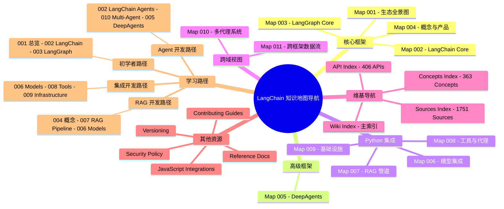

> Navigation: [[001-overview-architecture|001 总览]] | [[012-ecosystem-navigation|当前]]

## 概述
本文档是 LangChain 知识地图的导航中心，提供了整个生态系统的结构化索引。通过单一入口点，用户可以快速定位到感兴趣的框架、组件、集成或学习路径。该导航中心覆盖了 LangChain 生态的 12 个核心知识地图以及维基文档索引，为不同层次和目标的学习者提供清晰的知识图谱。

## 知识地图

## 关键统计

| 类别 | 地图数量 | 覆盖范围 |
|------|---------|---------|
| 核心框架 | 4 | LangChain Core, LangGraph, 概念与产品, 生态全景 |
| 高级框架 | 1 | DeepAgents |
| Python 集成 | 4 | 模型, RAG, 工具, 基础设施 |
| 跨域视图 | 2 | 多代理系统, 数据流 |
| 维基资源 | 4 | 主索引, API, 概念, 源码 |

## 地图索引

| 编号 | 地图名称 | 域 | 描述 |
|------|---------|-----|------|
| 001 | 生态全景图 | 全域 | LangChain 生态完整架构总览 |
| 002 | LangChain Core | lc | 核心框架组件与抽象 |
| 003 | LangGraph Core | lg | 图式编排引擎与状态管理 |
| 004 | 概念与产品 | cp | 核心概念与产品分类 |
| 005 | DeepAgents | da | 高级代理框架 |
| 006 | 模型集成 | py | LLM, Chat, Embedding 集成 |
| 007 | RAG 管道 | py | 检索增强生成流程 |
| 008 | 工具与代理 | py | 工具集成与代理能力 |
| 009 | 基础设施 | py | 向量存储与文档加载 |
| 010 | 多代理系统 | xref | 代理协作模式 |
| 011 | 跨框架数据流 | xref | 框架间数据交互 |
| 012 | 导航中心 | navigation | 本文档 |

## 学习路径

### 初学者路径
适合刚接触 LangChain 的开发者，按顺序学习可建立完整的知识体系：
1. **001 生态全景图** → 了解全貌
2. **002 LangChain Core** → 掌握核心框架
3. **003 LangGraph Core** → 理解图式编排

### RAG 开发路径
专注于检索增强生成应用开发：
1. **004 概念与产品** → 理解 RAG 概念
2. **007 RAG 管道** → 掌握 RAG 流程
3. **006 模型集成** → 集成嵌入与聊天模型

### Agent 开发路径
专注于智能代理系统开发：
1. **002 LangChain Agents** → 基础代理能力
2. **010 多代理系统** → 代理协作
3. **005 DeepAgents** → 高级代理框架

### 集成开发路径
专注于第三方服务集成：
1. **006 模型集成** → 模型提供商集成
2. **008 工具与代理** → 工具集成
3. **009 基础设施** → 向量存储与文档处理

## 关联地图

| 主题 | 关联地图 | 关联主题 |
|------|---------|---------|
| 核心框架 | 001, 002, 003, 004 | LangChain 基础能力 |
| 高级应用 | 005, 010 | Agent 与多系统 |
| 数据集成 | 006, 007, 009 | 模型、RAG、基础设施 |
| 跨框架 | 011 | 框架间交互 |

## 相关 Wiki 页面

### 索引页面
- [[wiki-index|Wiki 主索引]] - 所有维基页面入口
- [[api-index|API 索引]] - 406 个 API 参考
- [[concepts-index|概念索引]] - 363 个核心概念
- [[sources-index|源码索引]] - 1751 个源码引用

### 指南文档
- [[contributing-guide|贡献指南]] - 如何参与贡献
- [[reference-docs|参考文档]] - 官方参考文档
- [[javascript-integration|JavaScript 集成]] - JS/TS 支持
- [[security-policy|安全策略]] - 安全最佳实践
- [[versioning-policy|版本策略]] - 版本管理规范
